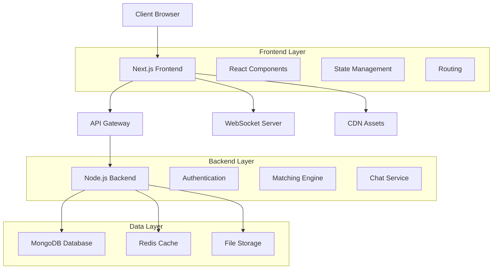
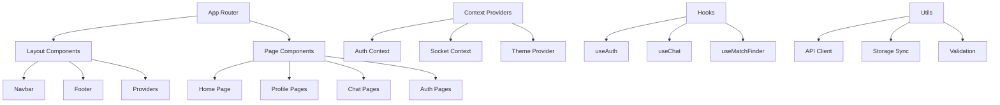

# Soulara - Dat## 📋 Table of Contents

- [🌟 Overview](#-overview)
- [🏗️ System Architecture](#️-system-architecture)
- [🛠️ Technology Stack](#️-technology-stack)
- [📁 Project Structure](#-project-structure)
- [✨ Features](#-features)
- [🚀 Getting Started](#-getting-started)
- [💻 Development](#-development)
- [🚀 Deployment](#-deployment-1)
- [🔌 API Integration](#-api-integration)
- [⚡ Performance & Optimization](#-performance--optimization)
- [🧪 Testing](#-testing)
- [🤝 Contributing](#-contributing)
- [📄 License](#-license)
- [🙋‍♂️ Support](#️-support)ontend

<div align="center">
  
  
  [](https://nextjs.org/)
  [](https://www.typescriptlang.org/)
  [](https://tailwindcss.com/)
  []()
  
  **A modern, soul-focused dating platform built with Next.js and TypeScript**
  
  [Live Demo](https://soulara.app) • [API Documentation](../backend/README.md) • [Contributing](#contributing)
</div>

## � Table of Contents

- [✨ Features](#-features)
- [🛠️ Tech Stack](#️-tech-stack)
- [🏗️ System Architecture](#️-system-architecture)
- [🚀 Getting Started](#-getting-started)
- [🔌 API Integration](#-api-integration)
- [🌐 Deployment](#-deployment)
- [🤝 Contributing](#-contributing)
- [📄 License](#-license)

## 🌟 Overview

Soulara is a sophisticated dating platform that focuses on deep, meaningful connections through spiritual and emotional compatibility. Unlike traditional dating apps that prioritize appearance, Soulara uses advanced personality assessments, spiritual values alignment, and soul-level matching algorithms.

### Key Differentiators
- **OCEAN Personality Assessment** - Scientific personality matching
- **Soul Compatibility Scoring** - Proprietary algorithm for deep connections
- **Real-time Chat System** - WebSocket-based instant messaging
- **Advanced Filtering** - Multi-dimensional preference matching
- **Progressive Web App** - Native-like mobile experience

## 🏗️ System Architecture

### High-Level Architecture



### Frontend Architecture



### Component Architecture

```
src/
├── app/                          # Next.js App Router
│   ├── (auth)/                   # Authentication routes
│   ├── (main)/                   # Main application routes
│   │   ├── _components/          # Shared components
│   │   ├── (matches)/           # Match-related pages
│   │   ├── (profile)/           # Profile management
│   │   └── chat/                # Chat functionality
│   ├── globals.css              # Global styles
│   └── layout.tsx               # Root layout
├── components/                   # Reusable UI components
│   ├── ui/                      # Base UI components (shadcn/ui)
│   ├── feedback/                # Feedback system
│   └── ocean/                   # Personality assessment
├── context/                     # React contexts
├── hooks/                       # Custom React hooks
├── lib/                         # Utility libraries
├── types/                       # TypeScript definitions
└── middleware.ts                # Next.js middleware
```

## 🛠️ Technology Stack

### Core Technologies
| Technology | Version | Purpose |
|------------|---------|---------|
| **Next.js** | 15.5.2 | React framework with App Router |
| **React** | 18.3.1 | UI library |
| **TypeScript** | 5.0+ | Type-safe JavaScript |
| **Tailwind CSS** | 3.4+ | Utility-first CSS framework |

### UI & Design
| Technology | Purpose |
|------------|---------|
| **shadcn/ui** | Pre-built accessible components |
| **Radix UI** | Headless UI primitives |
| **Lucide React** | Icon library |
| **Framer Motion** | Animation library |

### State Management & Data
| Technology | Purpose |
|------------|---------|
| **React Context** | Global state management |
| **React Query/SWR** | Server state management |
| **Zustand** | Client state management |

### Development Tools
| Tool | Purpose |
|------|---------|
| **ESLint** | Code linting |
| **Prettier** | Code formatting |
| **Husky** | Git hooks |
| **lint-staged** | Pre-commit linting |

## 📁 Project Structure

```
frontend/
├── 📄 README.md                 # Project documentation
├── 📄 package.json              # Dependencies and scripts
├── 📄 tailwind.config.js        # Tailwind configuration
├── 📄 next.config.ts            # Next.js configuration
├── 📄 tsconfig.json             # TypeScript configuration
├── 📄 middleware.ts             # Route middleware
├── 📁 public/                   # Static assets
│   ├── 📁 assets/               # Images and media
│   └── 📄 favicon.ico           # Site icon
├── 📁 src/                      # Source code
│   ├── 📁 app/                  # Next.js App Router
│   │   ├── 📄 layout.tsx        # Root layout
│   │   ├── 📄 page.tsx          # Home page
│   │   ├── 📄 globals.css       # Global styles
│   │   ├── 📁 (auth)/           # Authentication group
│   │   │   ├── 📁 login/        # Login page
│   │   │   └── 📁 signup/       # Registration page
│   │   └── 📁 (main)/           # Main app group
│   │       ├── 📄 layout.tsx    # Main layout
│   │       ├── 📁 _components/  # Shared components
│   │       ├── 📁 (profile)/    # Profile routes
│   │       ├── 📁 (matches)/    # Match routes
│   │       └── 📁 chat/         # Chat routes
│   ├── 📁 components/           # Reusable components
│   │   ├── 📁 ui/               # Base UI components
│   │   ├── 📁 feedback/         # Feedback system
│   │   └── 📁 ocean/            # Personality assessment
│   ├── 📁 context/              # React contexts
│   │   ├── 📄 AuthContext.tsx   # Authentication state
│   │   └── 📄 SocketContext.tsx # WebSocket connection
│   ├── 📁 hooks/                # Custom hooks
│   │   ├── 📄 useAuth.ts        # Authentication hook
│   │   ├── 📄 useChat.ts        # Chat functionality
│   │   └── 📄 useMatchFinder.ts # Matching logic
│   ├── 📁 lib/                  # Utility libraries
│   │   ├── 📄 api.ts            # API client
│   │   ├── 📄 utils.ts          # Utility functions
│   │   └── 📄 config.ts         # Configuration
│   └── 📁 types/                # TypeScript definitions
│       ├── 📄 auth.types.ts     # Authentication types
│       └── 📄 chat.types.ts     # Chat types
```

## ✨ Features

### 🔐 Authentication System
- **Multi-provider auth** (Email, Google, Facebook)
- **JWT token management** with automatic refresh
- **Protected routes** with middleware
- **Profile verification** system

### 👤 Profile Management
- **Comprehensive profile builder** with guided steps
- **Photo upload and management** with optimization
- **Privacy controls** and visibility settings
- **Profile verification badges**

### 🧠 OCEAN Personality Assessment
- **10-question assessment** covering 5 personality traits
- **Real-time progress tracking** with visual feedback
- **Results visualization** with detailed explanations
- **Compatibility scoring** based on personality match

### 💕 Matching System
- **Advanced filtering** by age, location, preferences
- **Soul compatibility algorithm** using multiple factors
- **Real-time match suggestions** with compatibility scores
- **Swipe interface** with smooth animations

### 💬 Real-time Chat
- **WebSocket-based messaging** for instant communication
- **Message status indicators** (sent, delivered, read)
- **Typing indicators** and online status
- **Media sharing** (photos, voice messages)

### 📱 Progressive Web App
- **Offline functionality** with service workers
- **Push notifications** for matches and messages
- **App-like experience** on mobile devices
- **Installation prompts** for native feel

## 🚀 Getting Started

### Prerequisites
```bash
Node.js >= 18.17.0
npm >= 9.0.0
Git
```

### Installation

1. **Clone the repository**
   ```bash
   git clone https://github.com/Pawandasila/build-to-bond-backend.git
   cd build-to-bond-backend/frontend
   ```

2. **Install dependencies**
   ```bash
   npm install
   ```

3. **Environment setup**
   ```bash
   cp .env.example .env.local
   ```
   
   Configure your environment variables:
   ```env
   NEXT_PUBLIC_API_URL=http://localhost:5000/api
   NEXT_PUBLIC_SOCKET_URL=ws://localhost:5000
   NEXT_PUBLIC_APP_URL=http://localhost:3000
   ```

4. **Start development server**
   ```bash
   npm run dev
   ```

5. **Open in browser**
   ```
   http://localhost:3000
   ```

### Build for Production

```bash
# Build the application
npm run build

# Start production server
npm start

# Run with PM2 (recommended)
pm2 start ecosystem.config.js
```

## 💻 Development

### Available Scripts

| Script | Description |
|--------|-------------|
| `npm run dev` | Start development server |
| `npm run build` | Build for production |
| `npm run start` | Start production server |
| `npm run lint` | Run ESLint |
| `npm run lint:fix` | Fix ESLint errors |
| `npm run type-check` | TypeScript type checking |
| `npm run format` | Format code with Prettier |

### Development Workflow

1. **Create feature branch**
   ```bash
   git checkout -b feature/new-feature
   ```

2. **Make changes** following the coding standards

3. **Run quality checks**
   ```bash
   npm run lint
   npm run type-check
   npm run test
   ```

4. **Commit changes**
   ```bash
   git add .
   git commit -m "feat: add new feature"
   ```

5. **Push and create PR**
   ```bash
   git push origin feature/new-feature
   ```

### Code Standards

- **TypeScript**: Strict mode enabled
- **ESLint**: Airbnb configuration with React hooks
- **Prettier**: Consistent code formatting
- **Conventional Commits**: Standardized commit messages

## 🚀 Deployment

### Vercel (Recommended)

1. **Connect repository** to Vercel
2. **Configure environment variables**
3. **Deploy automatically** on push to main

### Manual Deployment

```bash
# Build application
npm run build

# Deploy to your hosting provider
# Upload .next/ folder and package.json
```

### Docker Deployment

```dockerfile
# Dockerfile included in project
docker build -t soulara-frontend .
docker run -p 3000:3000 soulara-frontend
```

## 🔌 API Integration

### API Client Configuration

```typescript
// lib/api.ts
const apiClient = {
  baseURL: process.env.NEXT_PUBLIC_API_URL,
  timeout: 10000,
  headers: {
    'Content-Type': 'application/json',
  },
};
```

### Authentication Flow

```typescript
// Authentication with automatic token refresh
const { user, login, logout } = useAuth();

// API calls with auth
const response = await apiRequest('/profile', {
  method: 'GET',
  requireAuth: true,
});
```

### WebSocket Integration

```typescript
// Real-time chat connection
const { socket, sendMessage, messages } = useSocket();

useEffect(() => {
  socket?.on('message', handleNewMessage);
  return () => socket?.off('message', handleNewMessage);
}, [socket]);
```

## ⚡ Performance & Optimization

### Performance Features
- **Next.js App Router** for optimal routing
- **Image optimization** with next/image
- **Code splitting** for reduced bundle size
- **Service workers** for caching
- **CDN integration** for static assets

### Optimization Techniques
- **Lazy loading** for components and images
- **Virtualization** for large lists
- **Memoization** for expensive calculations
- **Bundle analysis** for size optimization

### Performance Metrics
- **Lighthouse Score**: 95+
- **First Contentful Paint**: < 1.5s
- **Time to Interactive**: < 2.5s
- **Cumulative Layout Shift**: < 0.1

## 🧪 Testing

### Testing Strategy

```bash
# Unit tests
npm run test

# E2E tests
npm run test:e2e

# Coverage report
npm run test:coverage
```

### Testing Stack
- **Jest**: Unit testing framework
- **React Testing Library**: Component testing
- **Cypress**: End-to-end testing
- **MSW**: API mocking

## 🤝 Contributing

We welcome contributions! Please see our [Contributing Guide](CONTRIBUTING.md) for details.

### Development Process
1. Fork the repository
2. Create a feature branch
3. Make your changes
4. Add tests if applicable
5. Submit a pull request

### Pull Request Guidelines
- Clear description of changes
- Tests passing
- Code properly formatted
- Documentation updated

## 📄 License

This project is licensed under the MIT License - see the [LICENSE](LICENSE) file for details.

## 🙋‍♂️ Support

- 📧 Email: support@soulara.app
- 🐛 Issues: [GitHub Issues](https://github.com/Pawandasila/build-to-bond-backend/issues)
- 💬 Discord: [Join our community](https://discord.gg/soulara)

---

<div align="center">
  Made with ❤️ by the Soulara Team
  
  [Website](https://soulara.app) • [Privacy Policy](https://soulara.app/privacy) • [Terms of Service](https://soulara.app/terms)
</div>

#### Base Colors (Neutral)
```css
--base-50: oklch(0.9787 0.0051 48.69)    /* Lightest cream */
--base-100: oklch(0.97 0.0056 49.59)     /* Very light cream */
--base-200: oklch(0.923 0.0071 49.85)    /* Light cream */
--base-300: oklch(0.8692 0.0082 50.43)   /* Medium light */
--base-400: oklch(0.709 0.0092 50.33)    /* Medium */
--base-500: oklch(0.5534 0.0099 51.95)   /* Base neutral */
--base-600: oklch(0.4436 0.0097 53.36)   /* Medium dark */
--base-700: oklch(0.3738 0.0089 52.39)   /* Dark */
--base-800: oklch(0.2682 0.0077 50.37)   /* Very dark */
--base-900: oklch(0.2149 0.0071 50.14)   /* Darkest */
--base-950: oklch(0.1469 0.0066 48.54)   /* Near black */
--base-1000: oklch(0.1024 0.0061 49.06)  /* Black */
```

#### Primary Colors (Brand)
```css
--primary-50: oklch(0.968 0.01 8.56)     /* Lightest brand */
--primary-100: oklch(0.9409 0.02 8.58)   /* Very light brand */
--primary-200: oklch(0.8922 0.0393 6.47) /* Light brand */
--primary-300: oklch(0.8112 0.0791 8.26) /* Medium light brand */
--primary-400: oklch(0.7126 0.1314 10.17)/* Medium brand */
--primary-500: oklch(0.6735 0.1652 12.99)/* Base brand color */
--primary-600: oklch(0.5866 0.17 14.55)  /* Medium dark brand */
--primary-700: oklch(0.5152 0.1496 14.3) /* Dark brand */
--primary-800: oklch(0.4551 0.1265 11.6) /* Very dark brand */
--primary-900: oklch(0.4092 0.1065 8.71) /* Darkest brand */
--primary-950: oklch(0.2723 0.0711 10.49)/* Near black brand */
--primary-1000: oklch(0.1836 0.048 11.64)/* Black brand */
```

#### Usage in Tailwind
```jsx
<div className="bg-base-50 text-base-800">Light background</div>
<div className="bg-primary-500 text-primary-foreground">Brand button</div>
<div className="bg-primary-100 text-primary-800">Light brand accent</div>
```

### Typography

#### Font Family Variables
```css
--font-roboto: Roboto             /* Clean, readable UI text */
--font-playfair: Playfair Display /* Elegant display headings */
--font-sans: Plus Jakarta Sans    /* Primary sans-serif */
--font-serif: Lora               /* Body serif text */
--font-mono: IBM Plex Mono       /* Code and monospace */
--font-marcellus: Marcellus      /* Logo and special headings */
--font-montserrat: Montserrat    /* Modern headings */
--font-homemade-apple: Homemade Apple /* Handwritten accents */
```

#### Usage Examples
```jsx
<h1 className="font-playfair text-4xl">Elegant Heading</h1>
<h2 className="font-marcellus text-2xl">Logo Style</h2>
<p className="font-sans">Body text</p>
<p className="font-serif">Serif body text</p>
<code className="font-mono">Code snippet</code>
<span className="font-homemade-apple">Handwritten</span>
```

### Component Architecture

#### Server vs Client Components

**Server Components** (Default)
```tsx
// No "use client" directive
import React from 'react'

const MyServerComponent = () => {
  // Server-side logic, database calls, etc.
  return <div>Server rendered content</div>
}
```

**Client Components** (Interactive)
```tsx
"use client"
import React, { useState } from 'react'

const MyClientComponent = () => {
  const [state, setState] = useState(false)
  return <button onClick={() => setState(!state)}>Interactive</button>
}
```

#### Component Organization
- **`_components/`**: Client-side interactive components
- **Regular folders**: Server components
- **`./_components/`**: Client components specific to a parent server component

### UI Components (shadcn/ui)

We use shadcn/ui for consistent, accessible components:

```bash
# Add new components
npx shadcn@latest add button
npx shadcn@latest add dropdown-menu
npx shadcn@latest add avatar
```

#### Available Components
- `Button` - Primary and secondary buttons
- `DropdownMenu` - Dropdown menus and popovers
- `Avatar` - User profile pictures
- More components as needed...

### Theme System

#### Dark/Light Mode
```jsx
// Automatic theme switching
<ThemeProvider
  attribute="class"
  defaultTheme="light"
  enableSystem
  disableTransitionOnChange
>
  {children}
</ThemeProvider>
```

#### Custom CSS Properties
```css
:root {
  --background: var(--base-50);
  --foreground: var(--base-800);
  --primary: var(--primary-500);
  --cream: var(--primary-50);
}

.dark {
  --background: var(--base-950);
  --foreground: var(--base-200);
  --cream: var(--primary-1000);
}
```

## 🛠️ Development Guidelines

### Code Style

#### Component Structure
```tsx
"use client" // Only if client component

import React from 'react'
import { cn } from '@/lib/utils'

interface ComponentProps {
  children: React.ReactNode
  className?: string
  variant?: 'primary' | 'secondary'
}

const MyComponent = ({ children, className, variant = 'primary' }: ComponentProps) => {
  return (
    <div className={cn(
      'base-styles',
      variant === 'primary' && 'primary-styles',
      variant === 'secondary' && 'secondary-styles',
      className
    )}>
      {children}
    </div>
  )
}

export default MyComponent
```

#### CSS Classes
- Use Tailwind utility classes
- Use `cn()` for conditional classes
- Follow the design system colors
- Prefer semantic color names (`bg-background`, `text-foreground`)

### File Naming
- **Components**: PascalCase (`MyComponent.tsx`)
- **Files/Folders**: kebab-case (`my-folder/`)
- **Constants**: UPPER_SNAKE_CASE

### Git Workflow
```bash
# Create feature branch
git checkout -b feature/component-name

# Commit with conventional commits
git commit -m "feat: add profile dropdown component"
git commit -m "fix: resolve navbar spacing issue"
git commit -m "docs: update component guidelines"

# Push and create PR
git push origin feature/component-name
```

## 📦 Available Scripts

```bash
npm run dev          # Development server
npm run build        # Production build
npm run start        # Production server
npm run lint         # ESLint
npm run type-check   # TypeScript check
```

## 🎯 Brand Guidelines

### Logo Usage
- **Soulara**: Use `font-marcellus` for logo text
- **Color**: `text-primary-700` for "Soul", `text-primary-500` for "ara"
- **Spacing**: Consistent with the Logo component

### Voice & Tone
- **Spiritual**: Warm, welcoming, mindful
- **Professional**: Clean, trustworthy, premium
- **Accessible**: Inclusive, clear, helpful

## 🔧 Common Patterns

### Navigation Items
```tsx
<NavbarItem
  icon={<IconComponent />}
  label="Item Name"
  badge={count > 0 ? count : undefined}
  onClick={handleClick}
/>
```

### Color Usage
```tsx
// Backgrounds
className="bg-background"      // Main background
className="bg-card"           // Card backgrounds
className="bg-primary"        // Brand actions

// Text
className="text-foreground"   // Primary text
className="text-muted-foreground" // Secondary text
className="text-primary"      // Brand text

// Interactive
className="hover:bg-accent"   // Hover states
className="focus:ring-primary" // Focus states
```

### Responsive Design
```tsx
className="text-sm md:text-base lg:text-lg"  // Responsive text
className="hidden md:block"                  // Responsive visibility
className="grid grid-cols-1 md:grid-cols-2 lg:grid-cols-3" // Responsive grid
```

## 🤝 Contributing

1. **Follow the design system** - Use predefined colors and fonts
2. **Write TypeScript** - Full type safety required
3. **Component patterns** - Follow established architectural patterns
4. **Test your components** - Ensure they work in both light and dark themes
5. **Documentation** - Update README for new patterns or components

## 📞 Support

For questions about the design system or development patterns:
- Check this README first
- Review existing components for patterns
- Ask in team channels for clarification

---

**Built with ❤️ for spiritual wellness and team collaboration**
