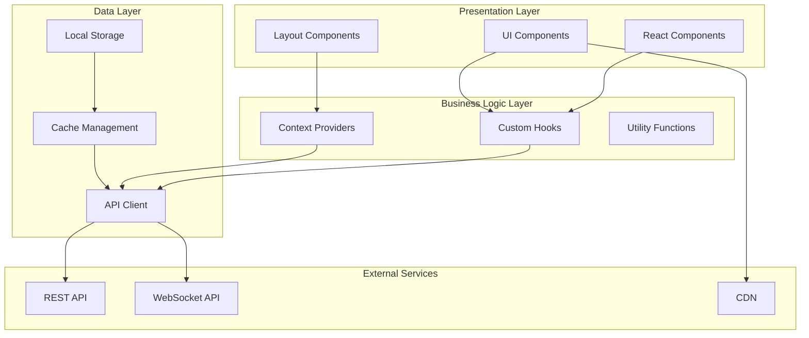
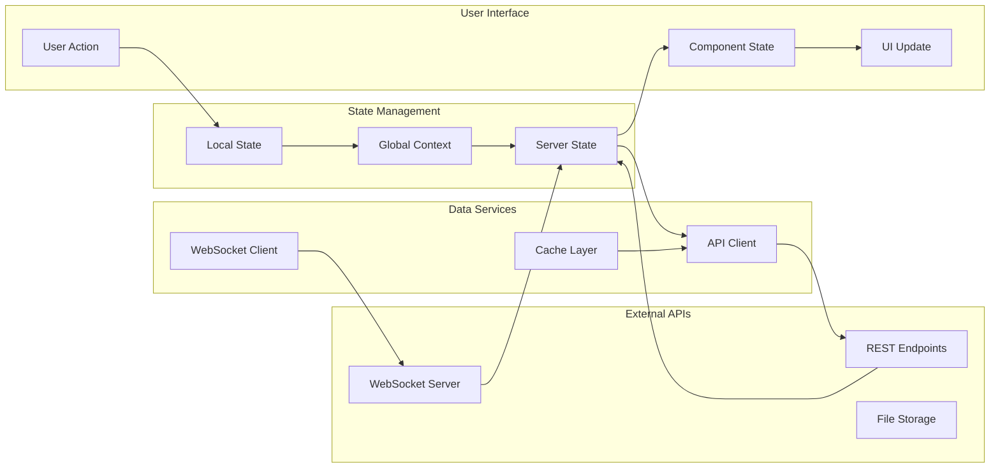
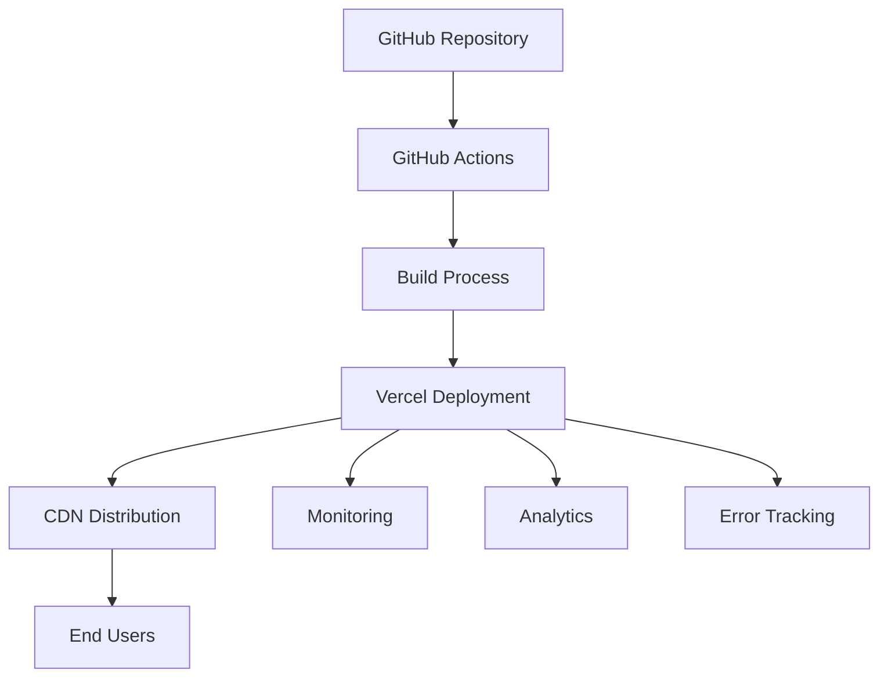

# System Architecture Documentation

## 📋 Table of Contents

- [🔍 Overview](#-overview)
- [🏗️ Architecture Principles](#️-architecture-principles)
- [🧩 System Components](#-system-components)
- [⚙️ Core Modules](#️-core-modules)
- [🎨 Design Patterns](#-design-patterns)
- [⚡ Performance Strategies](#-performance-strategies)
- [🔒 Security Considerations](#-security-considerations)
- [📊 Monitoring & Analytics](#-monitoring--analytics)
- [🚀 Deployment Architecture](#-deployment-architecture)
- [🔮 Future Considerations](#-future-considerations)

## 🔍 Overview

This document provides a comprehensive overview of the Soulara frontend system architecture, including design patterns, data flow, and technical decisions.

## 🏗️ Architecture Principles

### 1. Component-Driven Development
- **Atomic Design**: Components organized in atoms, molecules, organisms
- **Reusability**: Shared components across the application
- **Isolation**: Each component is self-contained and testable

### 2. Type Safety First
- **TypeScript**: Strict typing throughout the application
- **Interface-driven**: Clear contracts between components
- **Runtime validation**: Zod schemas for data validation

### 3. Performance by Design
- **Code splitting**: Route-based and component-based splitting
- **Lazy loading**: On-demand resource loading
- **Caching strategies**: Multiple levels of caching

## 🧩 System Components

### Frontend Layer



### Data Flow Architecture



## ⚙️ Core Modules

### 1. Authentication Module

```typescript
// Authentication Flow
interface AuthModule {
  // State management
  authContext: AuthContext;
  
  // Services
  authService: {
    login: (credentials: LoginCredentials) => Promise<AuthResponse>;
    logout: () => Promise<void>;
    refreshToken: () => Promise<TokenResponse>;
    validateToken: (token: string) => boolean;
  };
  
  // Hooks
  useAuth: () => AuthState;
  useAuthGuard: () => AuthGuard;
  
  // Components
  LoginForm: React.Component;
  SignupForm: React.Component;
  ProtectedRoute: React.Component;
}
```

**Key Features:**
- JWT token management with automatic refresh
- Protected route middleware
- Multi-provider authentication support
- Persistent session management

### 2. Chat Module

```typescript
// Real-time Chat Architecture
interface ChatModule {
  // WebSocket management
  socketContext: SocketContext;
  
  // Services
  chatService: {
    sendMessage: (message: MessageData) => Promise<void>;
    loadChatHistory: (chatId: string) => Promise<Message[]>;
    markAsRead: (messageId: string) => Promise<void>;
  };
  
  // Hooks
  useChat: (chatId: string) => ChatState;
  useTypingIndicator: () => TypingState;
  
  // Components
  ChatWindow: React.Component;
  MessageList: React.Component;
  MessageInput: React.Component;
}
```

**Key Features:**
- Real-time messaging with WebSocket
- Message status tracking (sent, delivered, read)
- Typing indicators and online presence
- Media sharing capabilities

### 3. Matching Module

```typescript
// Matching System Architecture
interface MatchingModule {
  // State management
  matchContext: MatchContext;
  
  // Services
  matchService: {
    getMatches: (filters: MatchFilters) => Promise<Match[]>;
    swipeMatch: (matchId: string, action: SwipeAction) => Promise<void>;
    calculateCompatibility: (userA: User, userB: User) => CompatibilityScore;
  };
  
  // Hooks
  useMatches: () => MatchState;
  useSwipeCards: () => SwipeState;
  
  // Components
  MatchCard: React.Component;
  SwipeInterface: React.Component;
  FilterPanel: React.Component;
}
```

**Key Features:**
- Advanced filtering system
- Compatibility algorithm integration
- Swipe gesture interface
- Real-time match updates

## 🎨 Design Patterns

### 1. Provider Pattern
Used for global state management and dependency injection.

```typescript
// Example: Auth Provider
export const AuthProvider: React.FC<{ children: React.ReactNode }> = ({ children }) => {
  const [user, setUser] = useState<User | null>(null);
  const [loading, setLoading] = useState(true);
  
  const contextValue = useMemo(() => ({
    user,
    login,
    logout,
    loading,
  }), [user, loading]);
  
  return (
    <AuthContext.Provider value={contextValue}>
      {children}
    </AuthContext.Provider>
  );
};
```

### 2. Custom Hooks Pattern
Encapsulating business logic and promoting reusability.

```typescript
// Example: Custom Hook
export const useChat = (chatId: string) => {
  const [messages, setMessages] = useState<Message[]>([]);
  const [loading, setLoading] = useState(false);
  
  const sendMessage = useCallback(async (content: string) => {
    // Message sending logic
  }, [chatId]);
  
  return {
    messages,
    loading,
    sendMessage,
  };
};
```

### 3. Compound Component Pattern
Building flexible and reusable UI components.

```typescript
// Example: Compound Component
const Modal = ({ children, isOpen, onClose }) => {
  return isOpen ? <div className="modal">{children}</div> : null;
};

Modal.Header = ({ children }) => <div className="modal-header">{children}</div>;
Modal.Body = ({ children }) => <div className="modal-body">{children}</div>;
Modal.Footer = ({ children }) => <div className="modal-footer">{children}</div>;
```

## ⚡ Performance Strategies

### 1. Code Splitting

```typescript
// Route-based splitting
const ProfilePage = lazy(() => import('./pages/ProfilePage'));
const ChatPage = lazy(() => import('./pages/ChatPage'));

// Component-based splitting
const HeavyComponent = lazy(() => import('./components/HeavyComponent'));
```

### 2. Memoization

```typescript
// Component memoization
const ExpensiveComponent = memo(({ data }) => {
  const processedData = useMemo(() => {
    return expensiveCalculation(data);
  }, [data]);
  
  return <div>{processedData}</div>;
});
```

### 3. Virtual Scrolling

```typescript
// For large lists
const VirtualizedList = ({ items }) => {
  return (
    <VariableSizeList
      height={600}
      itemCount={items.length}
      itemSize={getItemSize}
    >
      {({ index, style }) => (
        <div style={style}>
          <ListItem item={items[index]} />
        </div>
      )}
    </VariableSizeList>
  );
};
```

## 🔒 Security Considerations

### 1. Authentication Security
- JWT tokens stored in httpOnly cookies
- CSRF protection with double-submit cookies
- Token refresh mechanism for session management

### 2. Input Validation
- Client-side validation with Zod schemas
- Sanitization of user inputs
- XSS protection with proper escaping

### 3. API Security
- Request authentication headers
- Rate limiting on API calls
- HTTPS enforcement

## 📊 Monitoring & Analytics

### 1. Performance Monitoring

```typescript
// Performance tracking
const trackPageLoad = (pageName: string) => {
  const startTime = performance.now();
  
  return () => {
    const endTime = performance.now();
    analytics.track('page_load_time', {
      page: pageName,
      duration: endTime - startTime,
    });
  };
};
```

### 2. Error Tracking

```typescript
// Error boundary for error tracking
class ErrorBoundary extends Component {
  componentDidCatch(error: Error, errorInfo: ErrorInfo) {
    errorTracker.captureException(error, {
      extra: errorInfo,
    });
  }
}
```

### 3. User Analytics

```typescript
// User interaction tracking
const trackUserAction = (action: string, metadata?: object) => {
  analytics.track(action, {
    userId: user?.id,
    timestamp: new Date().toISOString(),
    ...metadata,
  });
};
```

## 🚀 Deployment Architecture

### 1. Build Pipeline

```yaml
# CI/CD Pipeline
build:
  - Install dependencies
  - Run type checking
  - Run linting
  - Run tests
  - Build application
  - Optimize assets

deploy:
  - Deploy to staging
  - Run E2E tests
  - Deploy to production
  - Monitor deployment
```

### 2. Infrastructure



### 3. Environment Management

```typescript
// Environment configuration
interface EnvironmentConfig {
  API_URL: string;
  SOCKET_URL: string;
  CDN_URL: string;
  ANALYTICS_KEY: string;
  ENVIRONMENT: 'development' | 'staging' | 'production';
}
```

## 🔮 Future Considerations

### 1. Scalability
- Micro-frontend architecture consideration
- Component library extraction
- Module federation implementation

### 2. Technology Evolution
- React Server Components adoption
- Web Assembly integration
- Progressive Web App enhancements

### 3. Performance Optimization
- Service worker implementation
- Edge computing utilization
- Advanced caching strategies